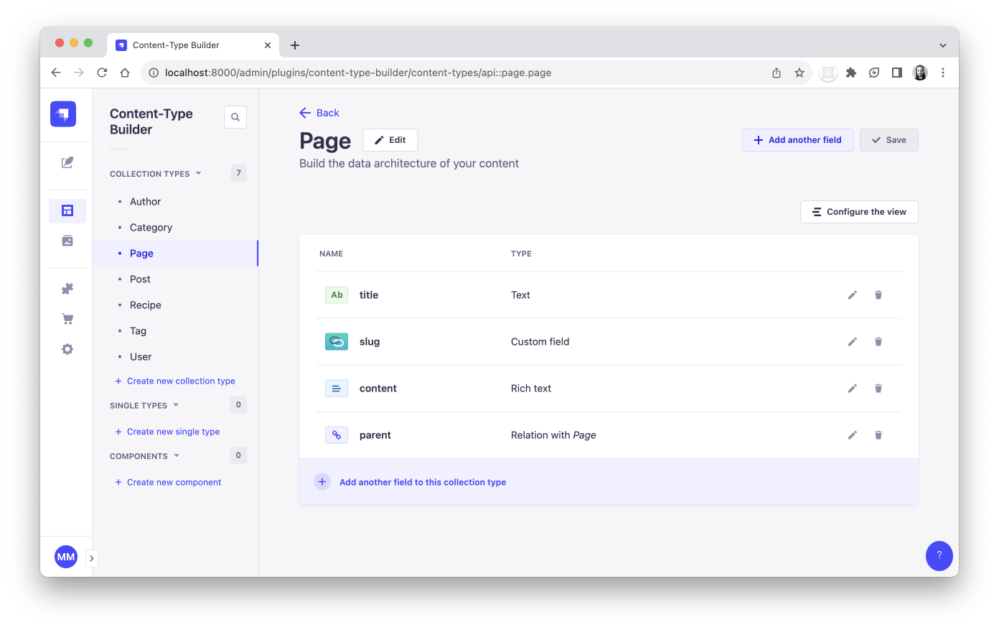
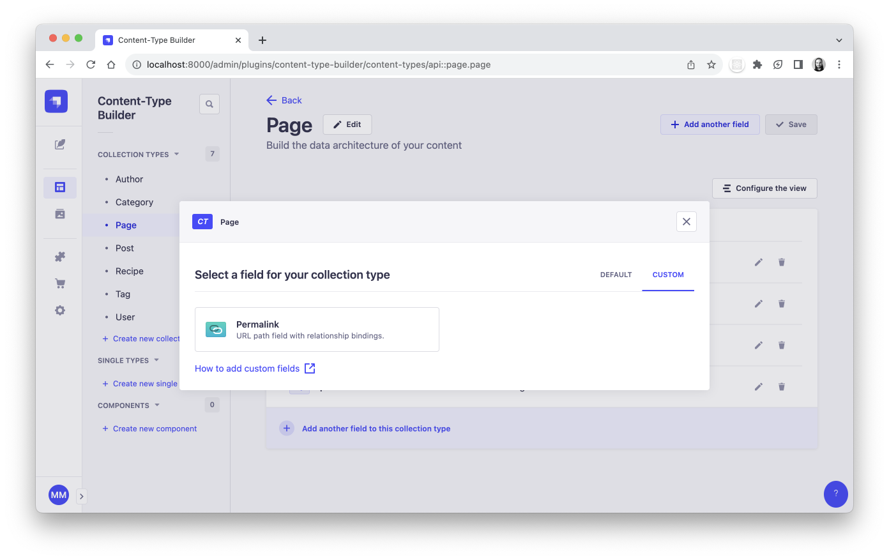

<div align="center">
  
  <h1>Strapi Permalinks</h1>
  <p>A plugin for Strapi CMS to enable permalinks for content types with nested relationships.</p>
  
</div>

## Get Started

* [Features](#features)
* [Installation](#installation)
* [Custom Field](#custom-field)
* [Configuration](#configuration)
* [User Guide](#user-guide)
* [Troubleshooting](#troubleshooting)
* [Support or Donate](#donate)
* [Roadmap](#roadmap)

## <a id="features"></a>✨ Features
* Use a custom field to manage a chain of URL paths to build a unique permalink.
* Nested relationships for content types.
* Parent/child relations can use different collection types.
* Customize which content types should use permalinks.
* Child relations automatically sync when parents change.
* Include optional button to copy the permalink to your clipboard.
* Supports localization with the `i18n` Strapi plugin.

## <a id="installation"></a>💎 Installation
```bash
yarn add strapi-plugin-permalinks@latest
```

## <a id="custom-field"></a>✏️ Custom Field
To get started, let's create a simple `Page` collection that uses a permalink field.



Use the "Custom" tab in the content type builder to add the permalink field to the model.



After adding a permalink field through the content type builder, there are additional `targetField` and `targetRelation` props that will need to be manually added to the permalink schema attribute.

> **NOTE:** Strapi does not currently provide the necessary params to dynamically render a list containing the other field names as select menu options in the content type builder, which is why `targetField` and `targetRelation` need to be added manually for now.

#### Schema for `Page`
```js
// src/api/page/content-types/page/schema.json

{
  "kind": "collectionType",
  "collectionName": "pages",
  "info": {
    "singularName": "page",
    "pluralName": "pages",
    "displayName": "Page"
  },
  "options": {
    "draftAndPublish": true
  },
  "pluginOptions": {},
  "attributes": {
    "title": {
      "type": "string",
      "required": true
    },
    "slug": {
      "type": "customField",
      "customField": "plugin::permalinks.permalink",
      "targetField": "title",
      "targetRelation": "parent",
      "required": true
    },
    "content": {
      "type": "richtext"
    },
    "parent": {
      "type": "relation",
      "relation": "oneToOne",
      "target": "api::page.page"
    }
  }
}
```

### `targetField`
This is the same `targetField` prop used with `uid` field types. It should point to a string type field which will be used to make suggestions for the unique permalink value.

### `targetRelation`
This prop should point to a `oneToOne` relation field which will be used as it's "parent" relation.

## <a id="configuration"></a>🔧 Configuration
In addition to the permalink attribute itself, we also need to enable the plugin config.

| property | type (default) | description |
| - | - | - |
| contentTypes | array (`[]`) | An array of objects describing related UIDs that use permalink fields. |
| contentTypes[].uids | array (`[]`) | The UID values for related collection types. |
| contentTypes[].url | string | The URL string template for a UID which can be used to create an absolute URL. See section about [mapping data into the URLs](#mapping-values-from-entry-data-into-preview-urls) for greater customization. |
| contentTypes[].copy | boolean (`true`) | Set to `false` to disable the "Copy permalink" button that appears in the edit view sidebar. |
| lowercase | boolean (`true`) | If set to `true`, it will ensure the input value is always lowercased. |

### `contentTypes`
An array of objects describing related UIDs that use permalink fields.

#### Example
Let's add our `Page` content type to the plugin config, which will enable it in middlewares, lifecycles, etc. and also help keep related collections synced as data changes.

```js
// config/plugins.js
'use strict';

module.exports = {
  'permalinks': {
    config: {
      contentTypes: [
        {
          uids: [ 'api::page.page' ],
        },
      ],
    },
  },
};
```

#### Example with mixed relations
In addition to our generic `Page` collection, let's say we have other collections representing different types of pages, such as `HelpPages` and `ProductPages`.

We will want to keep them all in sync with unique permalinks. Our config might look like the code below:

```js
// config/plugins.js
'use strict';

module.exports = {
  'permalinks': {
    config: {
      contentTypes: [
        {
          uids: [
            'api::page.page',
            'api::product-page.product-page',
          ],
        },
        {
          uids: [ 'api::help-page.help-page' ],
        },
      ],
    },
  },
};
```

This informs the plugin which collections should avoid permalink conflicts with other collections. Order of `uids` does not matter here.

**Here is a recap of what is achieved in this example:**
* `Pages` have parent `Pages` and will sync across `Pages` and `ProductPages`.
* `ProductPages` have parent `Pages` and will sync across `Pages` and `ProductPages`.
* `HelpPages` have parent `HelpPages` and will sync across `HelpPages`.

#### Example with absolute URLs

A permalink input is almost identical to a regular `uid` input in Strapi and therefore will not store a full URL string in the database. Instead we only save the unique path part of the URL.

In order to use the full permalink URL for the "Copy permalink" feature or to use the full permalink in API responses, you must configure the `url` option.

```js
// config/plugins.js
'use strict';

module.exports = ( { env } ) => ( {
  'permalinks': {
    config: {
      contentTypes: [
        {
          uids: [
            'api::page.page',
            'api::product-page.product-page',
          ],
          url: `${env( 'STRAPI_PERMALINKS_BASE_URL' )}/{slug}`,
        },
        {
          uids: [ 'api::help-page.help-page' ],
          url: `${env( 'STRAPI_PERMALINKS_BASE_URL' )}/help/{slug}`,
        },
      ],
    },
  },
} );
```

> Notice how the `HelpPage` example has `/help/` prepending it's slug value, which already makes it unique against `Page` and `ProductPage`.

#### Mapping values from entry data into permalink URLs
By using `{curly_braces}`, you can map values from the entry data into your permalink URLs to customize the URL however you like.

> **Unmatched values** will be replaced with an empty string.

```js
{
  uids: [ 'api::product-page.product-page' ],
  url: `${env( 'STRAPI_PERMALINKS_BASE_URL' )}/{category}/{slug}`,
}
```

#### Disable copy link button
The "Copy permalink" button located in the edit view sidebar can be disabled with the `copy: false` prop. This value is `true` by default.

```js
{
  uids: [ 'api::page.page' ],
  url: `${env( 'STRAPI_PERMALINKS_BASE_URL' )}/{slug}`,
  copy: false,
}
```

### `lowercase`
Defaults to `true`. It will ensure the permalink value is always lowercased.

> **NOTE:** If you are setting this option to `true` when it was previously set to `false`, it will not automatically lowercase existing permalinks in the database. You will need to lowercase existing permalinks yourself, which can be easily done with a database migration script.

```js
// config/plugins.js
'use strict';

module.exports = ( { env } ) => ( {
  'permalinks': {
    config: {
      lowercase: false,
      contentTypes: [
        // etc.
      ],
    },
  },
} );
```

#### Example migration script to lowercase existing permalinks

```js
// database/migrations/100-lowercase-permalinks.js
'use strict';

module.exports = {
  async up( knex ) {
    const rows = await knex( 'pages' );

    await Promise.all( rows.map( row => {
      return knex( uid )
        .where( { id: row.id } )
        .update( {
          slug: row.slug.toLowerCase(),
        } );
    } ) );
  },

  down() {},
};
```

## <a id="user-guide"></a>📘 User Guide
Assign a parent relation to an entity to automatically generate a URL path that includes the slugs of it's parent entities.

### Syncing entities with children
All child entities will automatically have their permalink values updated when the permalink of their ancestor changes. This extends down to all descendants.

### Deleting entities with children
Deleting an entity that has children will **orphan** those children. Strapi will automatically remove the parent relation from the child entities but no other changes to their data will occur.

**If orphaned pages exist**, you will see their slug value in the content manager list view as a red label instead of plain text.


Editing the orphaned page will display a warning and an error message on the permalink field. From here you can assign a new parent or no parent at all. Upon saving, any children of the entity will also update their target fields to reflect to new parent permalinks.


## <a id="troubleshooting"></a>💩 Troubleshooting

#### In general
Remember to **rebuild your app** after making changes to some config or other code.

```bash
yarn build
# OR
yarn develop
```

## <a id="donate"></a>❤️ Support or Donate
If you are enjoying this plugin and feel extra appreciative, you can [buy me a beer or 3 🍺🍺🍺](https://www.buymeacoffee.com/mattmilburn).

## <a id="roadmap"></a>🚧 Roadmap
* Config option to prevent using reserved slugs
* Config option to limit nesting depth
* Better conflict resolution for orphaned pages
* Better method for handling complicated localized URLs (currently requires plugin with custom hook and middleware)
* Use same content-type builder options as `uid` field, then deprecate it in plugin config (not currently possible)
